# Evolution Strategies — (μ + λ)-ES and (μ, λ)-ES in MATLAB

> **Historical project (2019).** Coursework for *Sistemas Inteligentes II* (Intelligent Systems II) at the
> Universidad de Guadalajara, CUCEI. The source code is preserved exactly as originally written.

## Project Overview

Two MATLAB scripts that search for the global minimum of two-variable functions using
**Evolution Strategies (ES)**, a family of evolutionary algorithms for continuous optimization.
Each script implements one population-replacement scheme:

| Script | Strategy | μ (population) | λ (offspring) |
|---|---|---|---|
| [`src/UmasLambda.m`](src/UmasLambda.m) | (μ + λ)-ES — "U más Lambda" | 100 | 30 |
| [`src/UcomaLambda.m`](src/UcomaLambda.m) | (μ, λ)-ES — "U coma Lambda" | 100 | 90 |

Both scripts animate the population over 15 generations on top of a 3D surface + contour plot
of the objective function.

## Project Context

| | |
|---|---|
| **Project origin** | Academic / University Project — Coursework / Assignment (**Confirmed**) |
| **Institution** | Universidad de Guadalajara — CUCEI (Centro Universitario de Ciencias Exactas e Ingenierías) |
| **Course** | Sistemas Inteligentes II |
| **Activity** | Práctica 4 |
| **Report date** | Friday, 22 February 2019 |
| **Author** | Omar Baruch Morón López |
| **Uploaded to GitHub** | 20 February 2021 |

Evidence: the university logo, course name, practice number and date on every page of the original
report ([`docs/original/Practica4.pdf`](docs/original/Practica4.pdf)), and the author header inside both scripts.

## Problem Statement

The assignment (translated from Spanish) asked for:

> Write a computer program that finds the global minimum of the following functions using the
> Evolution Strategies (μ + λ)-ES and (μ, λ)-ES:
>
> - f(x, y) = x·e^(−x² − y²), x, y ∈ [−2, 2]
> - f(**x**) = Σᵢ₌₁ᵈ (xᵢ − 2)², d = 2
>
> Which evolution strategy is better? Why?

## Objective

Implement both ES variants, run them on both functions, visually compare how the population
converges, and argue which strategy is preferable. See [`docs/assignment.md`](docs/assignment.md).

## Repository Structure

```
.
├── README.md                  ← this file
├── AGENTS.md                  ← rules for anyone (human or AI agent) changing this repository
├── LICENSE                    ← MIT (original)
├── src/                       ← ORIGINAL MATLAB source code (unmodified)
│   ├── UmasLambda.m           ← (μ + λ)-ES
│   └── UcomaLambda.m          ← (μ, λ)-ES
├── docs/
│   ├── project-context.md     ← origin, scope and historical information
│   ├── assignment.md          ← original assignment requirements
│   ├── report.md              ← Markdown version of the original PDF report
│   ├── code-overview.md       ← what each script does, step by step
│   ├── possible-improvements.md ← observations NOT applied to the code
│   └── original/
│       └── Practica4.pdf      ← original submitted report
├── specs/                     ← intent / spec / plan reconstructed from the existing project
│   ├── intent.md
│   ├── spec.md
│   └── plan.md
└── assets/images/report/      ← figures extracted from the original report
```

## Original Implementation

This repository preserves the original implementation of the project. The source code has
intentionally not been refactored or modernized in order to retain the historical context and
original development approach. The source code represents the original implementation developed
during my university studies.

Files were only **moved** into `src/` (byte-for-byte identical, including Spanish comments,
informal language and original CRLF line endings). Observations about the code are kept separately in
[`docs/possible-improvements.md`](docs/possible-improvements.md).

## Technologies

- **MATLAB** (scripts, anonymous functions, `meshgrid`, `surfc`, `plot3`)
- `normrnd` — from the MATLAB **Statistics and Machine Learning Toolbox** (Inferred: `normrnd` is part of that toolbox)

The MATLAB version originally used is **Unknown**.

## How It Works

1. Define the objective function `f` and a grid to draw its surface.
2. Initialize μ = 100 individuals uniformly at random in [−5, 5]², each with a random step size σ ∈ [0, 1)².
3. For each of G = 15 generations:
   - **Recombination:** each child is the average of two different random parents (genes and σ).
   - **Mutation:** Gaussian noise `normrnd(0, σ)` is added to the child.
   - **Evaluation & selection:** individuals are ranked by fitness (ascending, i.e. minimization);
     the replacement differs between the two scripts (see [`docs/code-overview.md`](docs/code-overview.md)).
   - **Visualization:** population drawn as black `*` (extra slots after μ in red `o`) over `surfc`, then `pause(.5)`.

## Inputs and Outputs

- **Inputs:** none from files. All parameters are hard-coded under
  `%% VARIABLES QUE SE PUEDEN MODIFICAR` (G, mu, lambda) and the bounds `xl`, `xu`.
  The objective function is chosen by commenting/uncommenting blocks at the top of each script.
- **Outputs:** an animated MATLAB figure, plus the `sigma` matrix printed to the Command Window every
  generation (the line has no trailing semicolon). No files are written.

## Running the Project

Requires MATLAB with the Statistics and Machine Learning Toolbox (for `normrnd`).

```matlab
cd src
UmasLambda    % (μ + λ)-ES
UcomaLambda   % (μ, λ)-ES
```

Note: each script starts with `clear all; close all; clc`. As committed, both scripts use
f(x, y) = x·e^(−x² − y²); to reproduce the sphere-function results, comment that block and
uncomment the `(x-2).^2 + (y-2).^2` block at the top of the script.

## Results (from the original report)

| | Generation 1 | Generation 10 | Generation 15 |
|---|---|---|---|
| **Sphere, (μ + λ)** | 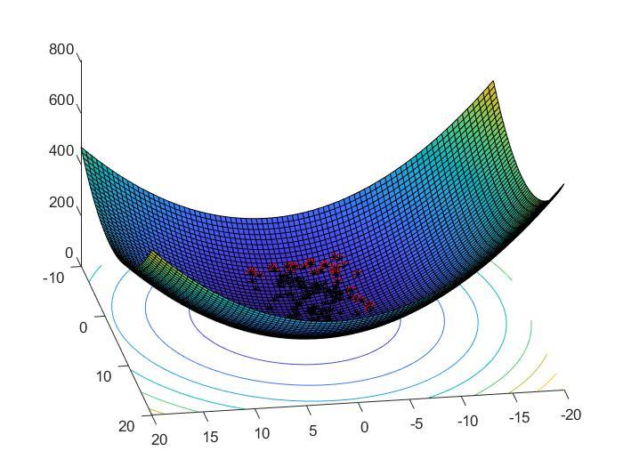 | 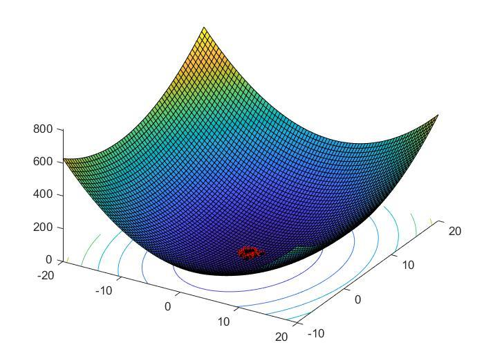 | 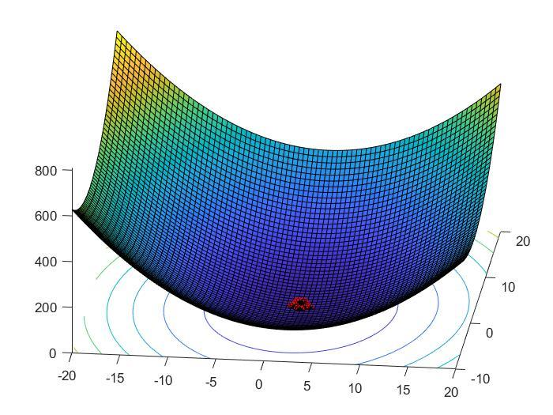 |
| **Sphere, (μ, λ)** | 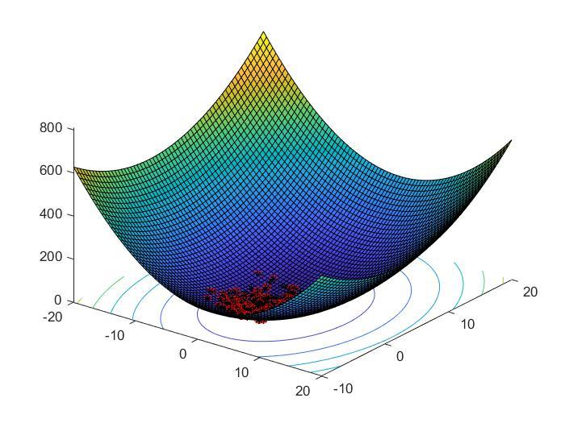 | 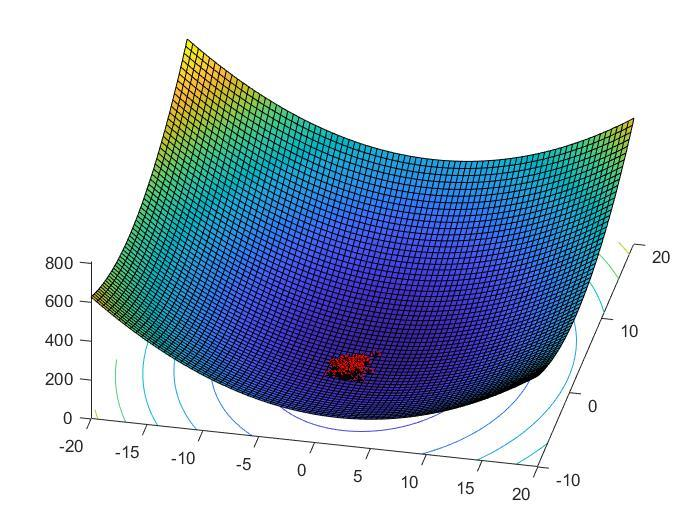 | 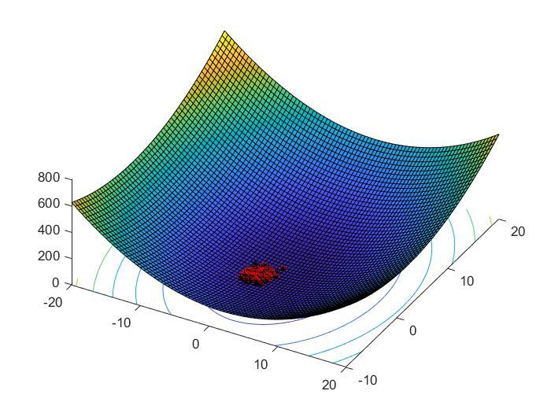 |
| **x·e^(−x²−y²), (μ + λ)** | 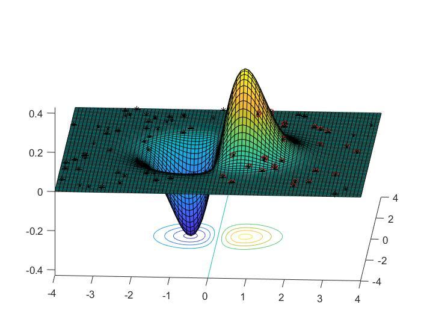 | 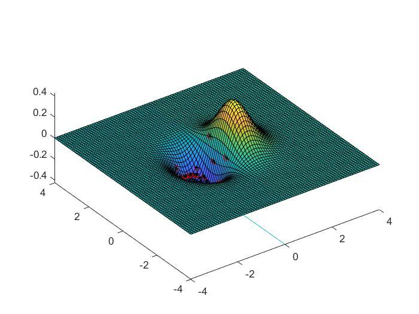 | 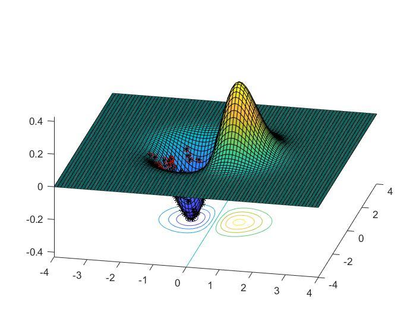 |
| **x·e^(−x²−y²), (μ, λ)** | 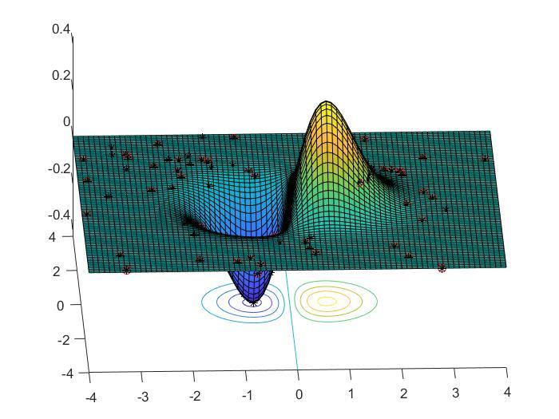 | 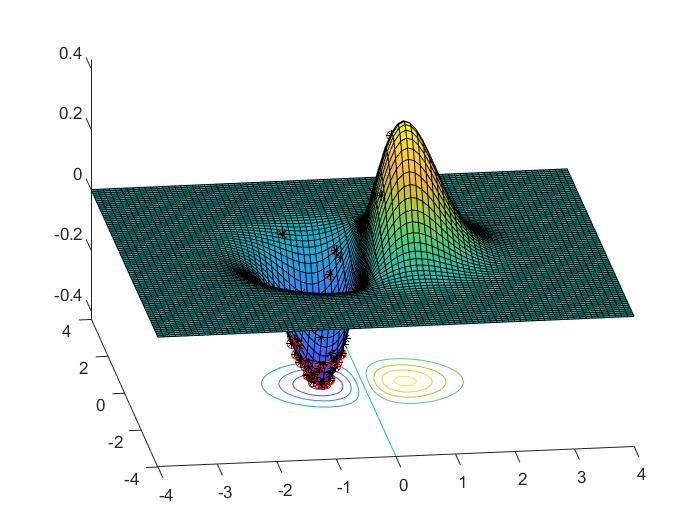 | 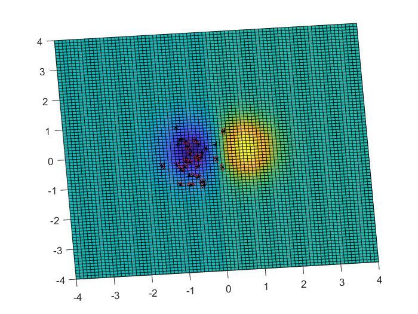 |

**Original conclusion (summarized):** (μ + λ)-ES evolves more slowly but, once near the solution,
the population stays stable; (μ, λ)-ES converges very fast but mutated children keep drifting away
from the optimum every generation. The author recommended keeping λ at most ~20% of μ.
Full details in [`docs/report.md`](docs/report.md).

## Documentation

- [Project context](docs/project-context.md)
- [Assignment](docs/assignment.md)
- [Report](docs/report.md)
- [Code overview](docs/code-overview.md)
- [Possible improvements (not applied)](docs/possible-improvements.md)
- [Intent](specs/intent.md) · [Spec](specs/spec.md) · [Plan](specs/plan.md)

## Historical Note

This repository was later reorganized and documented to improve readability and preserve the
historical context of the original project. The original source code remains unchanged.

## License

[MIT](LICENSE) © 2021 Baruch Lopez
